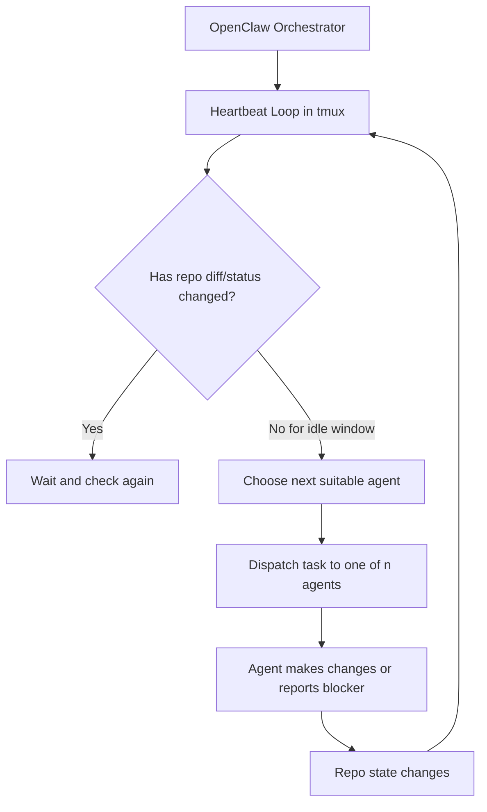

# OpenClaw Agent Flow Template

A simple starter for people who want OpenClaw to orchestrate `n` AI agents inside one project.

This repo ships with a simple two-agent example so it is easy to understand and easy to try first.

The main idea of this project is not just "a few agents exist."

The important part is this:

- OpenClaw acts as the orchestrator
- it checks the project on a repeating heartbeat
- when the repo is idle, it sends the next task to an agent
- when the repo changes, it waits and checks again
- this creates an iterative work loop instead of one-off agent calls

This repo gives you:

- a place to describe your project
- a place to describe what each agent should do
- scripts to start and check the workflow
- a background loop that can wake up and send work automatically
- a per-dispatch summary trail so you can review what each run did without committing every few minutes

You can copy this repo into a real project and edit it there.

If you want one copy-paste instruction for Codex or another coding agent, use [prompt.txt](./prompt.txt).

If you want one machine-wide command that creates new projects from this template, see [docs/global-setup.md](./docs/global-setup.md).

## Process Flow



The key point is that OpenClaw keeps the work moving in a loop:

- check the repo
- decide whether it is idle
- dispatch the next suitable agent
- observe the result
- repeat

## In Plain English

This template follows a simple idea:

1. OpenClaw runs on your machine.
2. OpenClaw is the orchestrator for the agent flow.
3. This repo keeps the project rules and the agent roles.
4. A background loop checks the project every 5 minutes.
5. If nothing changed for 5 minutes, it sends the next task to a suitable agent.
6. If the project changed, it waits, then checks again.

The default rule is `diff-only`, which means the workflow reacts to project file changes, not just agent chatter.

So the outstanding point of this template is:

- OpenClaw is orchestrating an iterative agent workflow
- not just launching isolated agent prompts
- and that pattern can work with `n` specialized agents

## Fast Start

1. Copy this repo or create a new repo from it.
2. Edit [AGENTS.md](./AGENTS.md) to describe the project rules.
3. Edit [.openclaw/project.json](./.openclaw/project.json) to set the project name and timing.
4. Edit the starter role files:
   - [.openclaw/roles/agent-a.md](./.openclaw/roles/agent-a.md)
   - [.openclaw/roles/agent-b.md](./.openclaw/roles/agent-b.md)
5. Run these commands:

```bash
bash scripts/openclaw/setup-project-agents.sh
bash scripts/openclaw/start-supervisor-tmux.sh
```

If you want to send work manually:

```bash
bash scripts/openclaw/dispatch-primary.sh "Review the repo and take the next safe task."
bash scripts/openclaw/dispatch-secondary.sh "Improve the next clear part of the product."
```

## Useful Commands

```bash
npm run agents:setup
npm run agents:primary
npm run agents:secondary
npm run agents:supervisor:start
npm run agents:supervisor:status
npm run agents:supervisor:stop
```

## Global Bootstrap

This repo also includes an optional global setup step.

Use it if you want one reusable command that creates new project folders from this template.

Install it once:

```bash
bash scripts/bootstrap/install-global.sh
```

Then you can create a new project with:

```bash
new-agent-flow my-project
```

## Folder Guide

- [.openclaw/project.json](./.openclaw/project.json): the main project settings
- [.openclaw/roles/](./.openclaw/roles): what each agent is supposed to do
- [scripts/openclaw/](./scripts/openclaw): the main workflow scripts
- [scripts/bootstrap/](./scripts/bootstrap): optional machine-wide setup scripts
- [docs/](./docs): guides and examples
