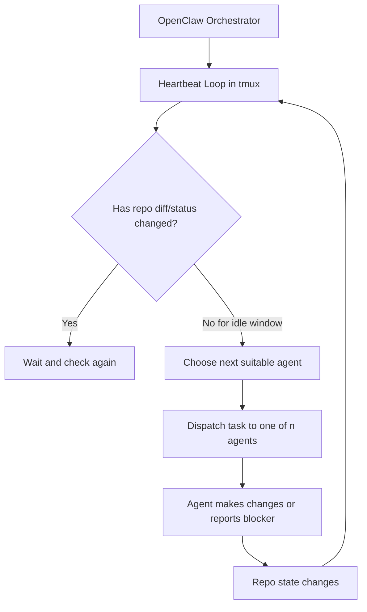

# OpenClaw Agent Flow Template

A simple starter for people who want OpenClaw to orchestrate `n` AI agents inside one project.

This repo ships with a simple two-agent example so it is easy to understand and easy to try first.

The important part is not just that "a few agents exist."

The important part is this:

- OpenClaw acts as the orchestrator
- it checks the project on a repeating heartbeat
- when the repo is idle, it sends the next task to an agent
- when the repo changes, it waits and checks again
- this creates an iterative work loop instead of one-off agent calls

One important best practice is easy to miss:

- the loop also needs a stopping rule
- agents should not keep getting redispatched forever just because the repo is idle
- each run should end with a simple status such as `continue`, `done`, `blocked`, or `defer`

## 30-Second Quickstart

If you already understand the idea, this is the shortest path to seeing it work:

```bash
# 1) edit these for your real project
$EDITOR AGENTS.md \
  .openclaw/project.json \
  .openclaw/roles/agent-a.md \
  .openclaw/roles/agent-b.md

# 2) register the project-local agents
bash scripts/openclaw/setup-project-agents.sh

# 3) sanity-check manual dispatch
bash scripts/openclaw/dispatch-primary.sh "State your role in one short sentence."
bash scripts/openclaw/dispatch-secondary.sh "State your role in one short sentence."

# 4) start the background loop
bash scripts/openclaw/start-supervisor-tmux.sh
bash scripts/openclaw/supervisor-status.sh
```

For the fuller walkthrough, see [docs/quickstart.md](./docs/quickstart.md).

## What You Get

This repo gives you:

- a place to describe your project
- a place to describe what each agent should do
- scripts to start and check the workflow
- a background loop that can wake up and send work automatically
- a per-dispatch summary trail so you can review what each run did without committing every few minutes
- a clear best-practice pattern for deciding when an agent should stop instead of looping forever

You can copy this repo into a real project and edit it there.

If you want one copy-paste instruction for Codex or another coding agent, use [prompt.txt](./prompt.txt).

If you want one machine-wide command that creates new projects from this template, see [docs/global-setup.md](./docs/global-setup.md).

## Process Flow



The key point is that OpenClaw keeps the work moving in a loop:

- check the repo
- decide whether it is idle
- dispatch the next suitable agent
- observe the result
- repeat

But the repeat step should not be blind.

The best-practice version is:

- dispatch work
- require the agent to say whether it should `continue`, is `done`, is `blocked`, or should `defer`
- stop redispatching lanes that are done or blocked until new input arrives
- keep the final report concise enough that the supervisor can record the result cleanly

## In Plain English

This template follows a simple idea:

1. OpenClaw runs on your machine.
2. OpenClaw is the orchestrator for the agent flow.
3. This repo keeps the project rules and the agent roles.
4. A background loop checks the project every 5 minutes.
5. If nothing changed for 5 minutes, it sends the next task to a suitable agent.
6. If the project changed, it waits, then checks again.

To keep this from becoming a noisy infinite loop, each agent run should also answer:

- should this lane continue?
- is it done for now?
- is it blocked?
- should it be deferred?

The default rule is `diff-only`, which means the workflow reacts to project file changes, not just agent chatter.

So the main point of this template is:

- OpenClaw is orchestrating an iterative agent workflow
- not just launching isolated agent prompts
- and that pattern can work with `n` specialized agents

The best practice is:

- OpenClaw decides when to ask again
- the agent decides whether real work remains
- the repo records that status so the loop knows when to stop

If you choose to use OpenClaw hooks, the cleanest role for them is:

- help with side effects like summaries, memory snapshots, or notifications
- not replace the supervisor as the main dispatch decision-maker

## Starter Layouts

The repo starts with a simple two-agent setup because it is the easiest version to understand.

If you want a more realistic split, see:

- [docs/examples/data-plus-frontend.md](./docs/examples/data-plus-frontend.md)
- [docs/examples/three-agent-product.md](./docs/examples/three-agent-product.md)

The three-agent example is a good default for a real product repo:

- backend or product agent
- frontend or UX agent
- quality or ops agent

## Fast Start

1. Copy this repo or create a new repo from it.
2. Edit [AGENTS.md](./AGENTS.md) to describe the project rules.
3. Edit [.openclaw/project.json](./.openclaw/project.json) to set the project name and timing.
4. Edit the starter role files:
   - [.openclaw/roles/agent-a.md](./.openclaw/roles/agent-a.md)
   - [.openclaw/roles/agent-b.md](./.openclaw/roles/agent-b.md)
5. Run these commands:

```bash
bash scripts/openclaw/setup-project-agents.sh
bash scripts/openclaw/start-supervisor-tmux.sh
```

If you want to send work manually:

```bash
bash scripts/openclaw/dispatch-primary.sh "Review the repo and take the next safe task."
bash scripts/openclaw/dispatch-secondary.sh "Improve the next clear part of the product."

# for any extra agent beyond the starter pair
bash scripts/openclaw/dispatch-agent.sh <agent-key> "Take the next safe task for your role."
```

## Useful Commands

```bash
npm run agents:setup
npm run agents:primary
npm run agents:secondary
npm run agents:supervisor:start
npm run agents:supervisor:status
npm run agents:supervisor:stop
```

## Stop Conditions

This template works best when every dispatched task ends with one of four simple statuses:

- `continue`: there is a clear next bounded step
- `done`: the goal for this lane is complete for now
- `blocked`: the lane cannot continue without a new source, credential, decision, or schema change
- `defer`: more work is possible later, but not worth spending another cycle right now

Without this, a heartbeat loop can waste tokens on repeated low-value audit or no-op turns.

For the fuller explanation, see [docs/stop-conditions.md](./docs/stop-conditions.md).

## Context Handling

OpenClaw already has built-in session compaction and pruning behavior for long threads.

So this template keeps the repo-side logic simpler:

- OpenClaw handles context pressure inside the session
- the repo supervisor focuses on dispatch timing, stop states, and concise summaries

That keeps the control split cleaner unless you later prove you need custom rollover behavior.

## When Not To Use This Template

This template is a bad fit if:

- you only want one-off agent runs instead of an ongoing repo loop
- you only need a single agent and do not want role-based dispatch
- your repo has no clear safety boundaries or path ownership
- you do not want a tmux-based local supervisor process
- you actually need a heavier queue, approvals, or cross-machine job system

In those cases, a plain ACP session or a simpler single-agent workflow is usually better.

## Global Bootstrap

This repo also includes an optional global setup step.

Use it if you want one reusable command that creates new project folders from this template.

Install it once:

```bash
bash scripts/bootstrap/install-global.sh
```

Then you can create a new project with:

```bash
new-agent-flow my-project
```

## Folder Guide

- [.openclaw/project.json](./.openclaw/project.json): the main project settings
- [.openclaw/roles/](./.openclaw/roles): what each agent is supposed to do
- [scripts/openclaw/](./scripts/openclaw): the main workflow scripts
- [scripts/bootstrap/](./scripts/bootstrap): optional machine-wide setup scripts
- [docs/](./docs): guides and examples
